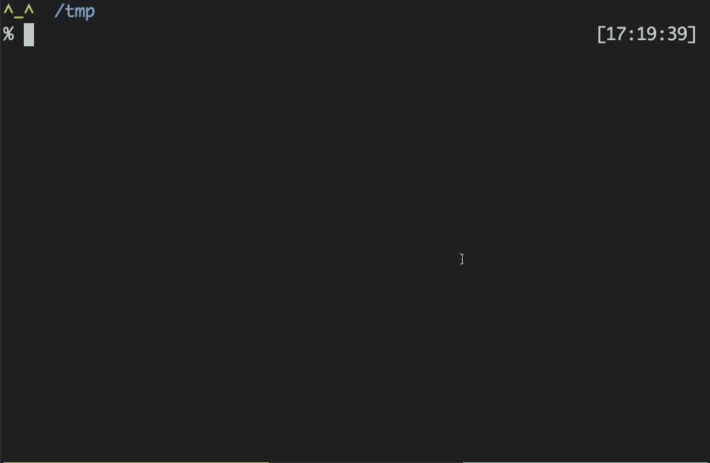

# TFLint
[](https://github.com/terraform-linters/tflint/actions)
[](https://github.com/terraform-linters/tflint/releases/latest)
[](docs/guides/compatibility.md)
[](https://hub.docker.com/r/wata727/tflint/)
[](LICENSE)
[](https://goreportcard.com/report/github.com/terraform-linters/tflint)

TFLint is a [Terraform](https://www.terraform.io/) linter focused on possible errors, best practices, etc.

## Why TFLint is required?

Terraform is a great tool for Infrastructure as Code. However, many of these tools don't validate provider-specific issues. For example, see the following configuration file:

```hcl
resource "aws_instance" "foo" {
  ami           = "ami-0ff8a91507f77f867"
  instance_type = "t1.2xlarge" # invalid type!
}
```

Since `t1.2xlarge` is a nonexistent instance type, an error will occur when you run `terraform apply`. But `terraform plan` and `terraform validate` cannot find this possible error beforehand. That's because it's an AWS provider-specific issue and it's valid as a Terraform configuration.

TFLint finds such errors in advance:



## Installation

You can download the binary built for your architecture from [the latest release](https://github.com/terraform-linters/tflint/releases/latest). The following is an example of installation on macOS:

```console
$ wget https://github.com/terraform-linters/tflint/releases/download/v0.12.1/tflint_darwin_amd64.zip
$ unzip tflint_darwin_amd64.zip
Archive:  tflint_darwin_amd64.zip
  inflating: tflint
$ mkdir -p /usr/local/tflint/bin
$ export PATH=/usr/local/tflint/bin:$PATH
$ install tflint /usr/local/tflint/bin
$ tflint -v
```

For Linux based OS, you can use the [`install_linux.sh`](https://raw.githubusercontent.com/terraform-linters/tflint/master/install_linux.sh) to automate the installation process, or try the following oneliner to download latest binary for AMD64 architecture.
```
$ curl -L "$(curl -Ls https://api.github.com/repos/terraform-linters/tflint/releases/latest | grep -o -E "https://.+?_linux_amd64.zip")" -o tflint.zip && unzip tflint.zip && rm tflint.zip
```

### Homebrew

macOS users can also use [Homebrew](https://brew.sh) to install TFLint:

```console
$ brew install tflint
```

### Docker

You can also use [TFLint via Docker](https://hub.docker.com/r/wata727/tflint/).

```console
$ docker run --rm -v $(pwd):/data -t terraform-linters/tflint
```

## Features

700+ rules are available. See [Rules](docs/rules).

## Limitations

TFLint currently only inspects Terraform-specific issues and AWS issues.

Also, load configurations in the same way as Terraform v0.12. This means that it cannot inspect configurations that cannot be parsed on Terraform v0.12.

See [Compatibility with Terraform](docs/guides/compatibility.md) for details.

## Usage

TFLint inspects all configurations under the current directory by default. You can also change the behavior with the following options:

```
$ tflint --help
Usage:
  tflint [OPTIONS] [FILE or DIR...]

Application Options:
  -v, --version                             Print TFLint version
      --langserver                          Start language server
  -f, --format=[default|json|checkstyle]    Output format (default: default)
  -c, --config=FILE                         Config file name (default: .tflint.hcl)
      --ignore-module=SOURCE                Ignore module sources
      --enable-rule=RULE_NAME               Enable rules from the command line
      --disable-rule=RULE_NAME              Disable rules from the command line
      --var-file=FILE                       Terraform variable file name
      --var='foo=bar'                       Set a Terraform variable
      --module                              Inspect modules
      --deep                                Enable deep check mode
      --aws-access-key=ACCESS_KEY           AWS access key used in deep check mode
      --aws-secret-key=SECRET_KEY           AWS secret key used in deep check mode
      --aws-profile=PROFILE                 AWS shared credential profile name used in deep check mode
      --aws-creds-file=FILE                 AWS shared credentials file path used in deep checking
      --aws-region=REGION                   AWS region used in deep check mode
      --force                               Return zero exit status even if issues found
      --no-color                            Disable colorized output

Help Options:
  -h, --help                                Show this help message
```

See [User guide](docs/guides) for each option.

## Exit Statuses

TFLint returns the following exit statuses on exit:

- 0: No issues found
- 2: Errors occurred
- 3: No errors occurred, but issues found

## FAQ
### Does TFLint check modules recursively?
- No. TFLint always checks only the current root module (no recursive check)

## Debugging

If you don't get the expected behavior, you can see the detailed logs when running with `TFLINT_LOG` environment variable.

```console
$ TFLINT_LOG=debug tflint
```

## Developing

See [Developer guide](docs/DEVELOPING.md).
