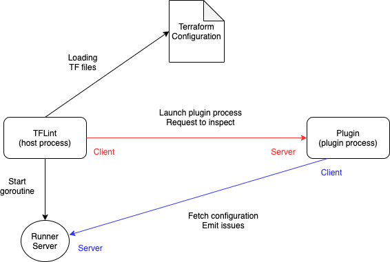

# Architecture

TFLint rules are provided by plugins. The plugin is launched as another process and communicates over RPC. Inspection requests and configuration file fetching, expression evaluation, etc. are performed by bi-directional communication, and the host process and plugin process act as both a server and a client.

The plugin system is implemented by [go-plugin](https://github.com/hashicorp/go-plugin). Since it uses a `net/rpc` based implementation, it uses [hashicorp/yamux](https://github.com/hashicorp/yamux) for communication multiplexing. See also [the go-plugin architecture description](https://github.com/hashicorp/go-plugin#architecture).
