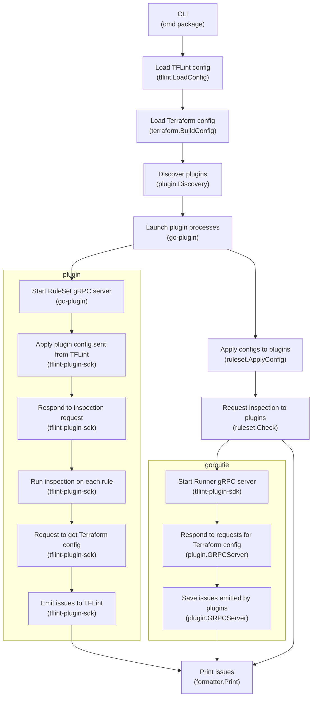
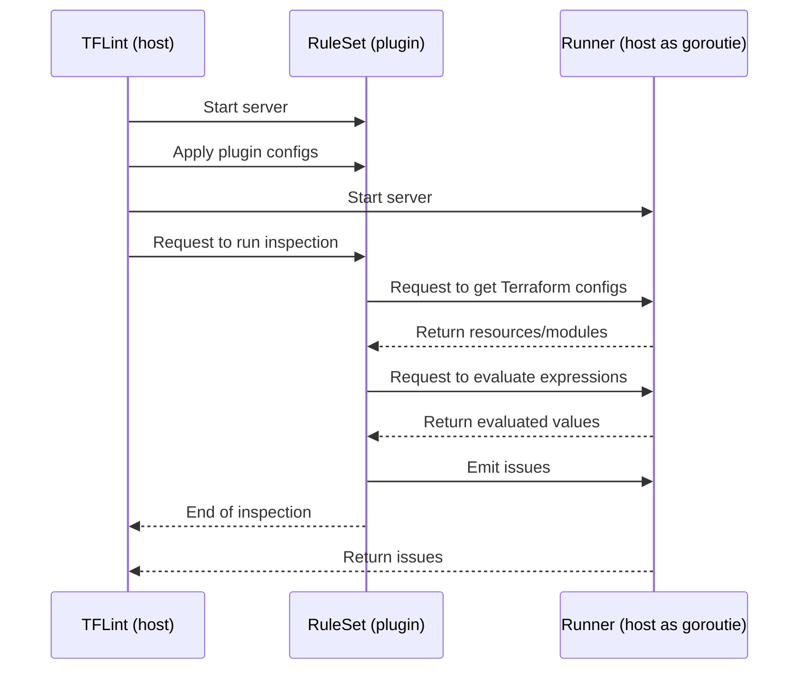
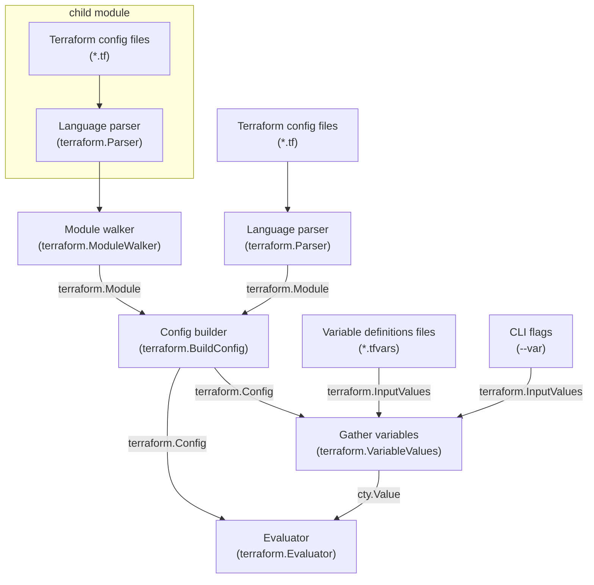

# Architecture

TFLint is a pluggable linter and does not contain any rule implementations. Rules are provided as plugins, these are launched by TFLint as subprocesses and communicate over gRPC.

An important part of understanding TFLint's architecture is that TFLint (host) and a plugin act as both gRPC server/client.

For example, the plugin (client) to the host (server) requests to:

- Retrieve Terraform configs (e.g. `aws_instance.main`)
- Evaluate expressions (e.g. `var.foo`)
- Save reported issues to the host server

The host (client) to the plugin (server) requests to:

- Apply plugin configs
- Request to run inspecions

The plugin system is implemented by [TFLint plugin SDK](https://github.com/terraform-linters/tflint-plugin-sdk). If you want to know more about `*.proto` and detailed gRPC server/client implementation, check out the SDK.

## Inspection Flow Diagram

The following diagram explains how an inspection is performed when a user executes command:

### CLI (`cmd` package)

[The `cmd` package](https://github.com/terraform-linters/tflint/tree/master/cmd) is the entrypoint of the CLI. `cmd.CLI` has streams to stdout/stderr and prints a result to the screen.

Depending on the user's instructions, it does the following:

- Run inspection
- Initialize TFLint (install plugins)
- Start language server
- Print version info
- Run bundled plugin (internal use)

This package is responsible for parsing CLI flags and arguments. The parsed `cmd.Option` is converted to `tflint.Config` and merged with a config file.

### Load TFLint config (`tflint.LoadConfig`)

[The `tflint` package](https://github.com/terraform-linters/tflint/tree/master/tflint) provides many features related to TFLint, such as loading a config file (`.tflint.hcl`) and parsing annotations (`# tflint-ignore` comments).

The `tflint.LoadConfig` loads a config file and returns `tflint.Config`. This config will be used in later steps.

### Load Terraform config (`terraform.BuildConfig`)

[The `terraform` package](https://github.com/terraform-linters/tflint/tree/master/terraform) is a fork of [github.com/hashicorp/terraform/internal](https://pkg.go.dev/github.com/hashicorp/terraform/internal). This package is responsible for processing the Terraform semantics, such as parsing `*.tf` files, evaluating expressions, and loading modules.

The `terraform.BuildConfig` builds a `terraform.Config` based on the parsed `terraform.Module`. These structures are designed to be as similar to Terraform core. See "The Design of `terraform` Package" section below for details.

### Discover plugins (`plugin.Discovery`)

[The `plugin` package](https://github.com/terraform-linters/tflint/tree/master/plugin) is responsible for the plugin system. This package contains gRPC server implementation, installation, discovery, etc.

The `plugin.Discovery` discovers installed plugins and launches plugin binaries as subprocesses. This detailed implementation is hidden by [github.com/hashicorp/go-plugin](https://github.com/hashicorp/go-plugin).

### Launch plugin processes (go-plugin)

The go-plugin launches a plugin binary as a subprocess. The launched plugin acts as a gRPC server and communicates with the host process.

The plugin server is called "RuleSet" server. Its behavior is implemented by a plugin developer.

### Apply configs to plugins (`ruleset.ApplyConfig`)

The `plugin.Discovery` returns a client for the RuleSet server it started. Use the `ApplyConfig` method to send the plugin config described in the config file to the server.

### Request inspection to plugins (`ruleset.Check`)

Similarly, send inspection requests to the server. The server responds to requests and runs an inspection, but the plugin needs access to `terraform.Config` (imagine `runner.GetResourceContent`).

For this, the host process launches a gRPC server to respond such requests. Ths host server is called "Runner" server. Its behavior is implemented by TFLint. The plugin is passed a client that corresponds to the Runner server.

### Respond to requests for Terraform config (`plugin.GRPCServer`)

The Runner server responds to requests from plugins to retrieve Terraform configs, evaluate expressions, etc. This implementation is contained in the `plugin` package.

### Save issues emitted by plugins (`plugin.GRPCServer`)

The Runner server saves issues emitted by plugins (imagine `runner.EmitIssue`). The saved issues will be printed to the screen in the next step.

### Print issues (`formatter.Print`)

[The `formatter` package](https://github.com/terraform-linters/tflint/tree/master/formatter)  processes and outputs issues in formats such as default, JSON, and SARIF.

## Inspection Sequence Diagram

The following diagram explains how the host process, RuleSet server, and Runner server each behave in inspection:

## The Design of `terraform` Package

The `terraform` package is a fork of Terraform internal packages. It is based on the same Terraform core, but with some implementation changes specifically for static analysis.

The following diagram explains the dependencies of each component:

### HCL and cty

The underlying technologies of Terraform language are [HCL](https://github.com/hashicorp/hcl) and [cty](https://github.com/zclconf/go-cty). The Terraform language implements its own semantics on top of these.

TFLint also leverages these technologies, making it highly compatible with Terraform.

### Differences from Terraform

The basic architecture is the same as Terraform. The biggest difference is that the `terraform.Evaluator` is state (`terraform.State`) independent. See also [Terraform Core Architecture Summary
](https://github.com/hashicorp/terraform/blob/main/docs/architecture.md).

State is not always available for static analysis as it can only be obtained by running terraform plan/apply. TFLint solves this problem in the same way as Terraform. Terraform has the ability to handle unknown values during first-time planning, and TFLint take advantage of this to always treat dynamic values as unknowns.

It has the same basic design as Terraform, so it has the advantage of being able to easily support future language extensions of Terraform.

### Lazy Schema Evaluation

Terraform has a predefined schema and uses it to decode HCL body. This is necessary to strictly define the syntax, but TFLint does not necessarily require a strict schema in order to support many versions of the Terraform language.

Against this background, `terraform.Module` in TFLint decodes minimal structure (e.g. `terraform.Variable`, `terraform.Resource`). The `terraform.Module` has native `hcl.File` and returns bodies based on the schema requested during inspection. In other words, it does lazy schema evaluation to achieve syntactic robustness.

For this reason, TFLint take a different approach to implementing `for_each` and `count` meta-arguments, and dynamic blocks than Terraform. Instead of being pre-expanded, it is expanded as an extension of `hcl.Body` when extracted by the schema.
