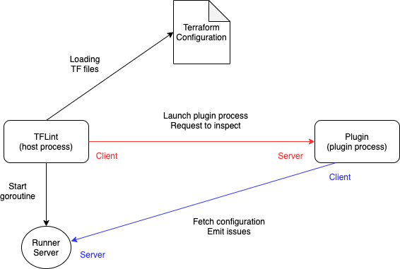

# Arquitectura

Las reglas de TFLint son proporcionadas por los plugins. Los plugins se lanza como otro proceso y se comunican entre ellos a través de RPC. Las solicitudes de inspección y la obtención de archivos de configuración, la evaluación de expresiones, etc. se realizan mediante comunicación bidireccional, y el proceso anfitrión y el proceso del plugin actúan como servidor y cliente.

El sistema de plugins está implementado por [go-plugin](https://github.com/hashicorp/go-plugin). Como utiliza una implementación basada en `net/rpc`, utiliza [hashicorp/yamux](https://github.com/hashicorp/yamux) para la multiplexación de las comunicaciones. Vea también [descripción de la arquitectura del go-plugin](https://github.com/hashicorp/go-plugin#architecture).
